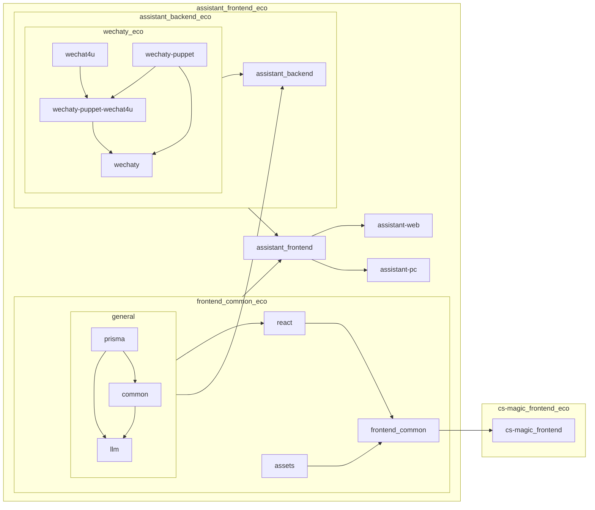

# CS魔法社 - 飞脑

[//]: # (![assistant Logo]&#40;packages/assistant-frontend/src/assets/branding/enterprise/assistant.png&#41;)

## Project Overview



## Run

```shell
# start web in dev
yarn workspace @cs-magic/assistant-backend dev & yarn workspace @cs-magic/assistant-web dev

# start pc in dev
yarn workspace assistant-pc dev

# build backend
yarn workspace @cs-magic/assistant-backend build

# build web
yarn workspace @cs-magic/assistant-frontend build

# build pc
yarn workspace assistant-pc build:mac

# start web after build
yarn workspace @cs-magic/assistant-frontend start

# start pc after build
# double click to install: packages/assistant-pc/dist/assistant-pc-${version}.dmg
```


## todo: logic on generate card

```shell
[//]: # (```mermaid)
subgraph backend

[bot]
link2card@app_assistant/backend/src/bot/handlers/handle-message/plugins/parser.plugin.ts

[simulator]
app_assistant/frontend-web/src/app/(home2)/card/gen/page.tsx
packages_frontend/common/src/components/card.tsx:Card (js)
packages_frontend/common/src/components/card-input-frontend.tsx:CardInputFrontend
packages_frontend/common/src/components/card-action-input.tsx:InputCardAction
packages_frontend/common/src/utils/gen-card.ts:genCardFromUrl
app_assistant/backend/src/bot/utils/wxmp-fetch.ts:fetchWxmpArticle
app_assistant/backend/src/bot/utils/wxmp-article/fetch/md2summary.ts:md2summary
packages/llm/src/utils/safe-call-agent.ts:safeCallAgent
packages/llm/src/utils/load-agent.ts:loadAgent

[//]: # (```)

```
